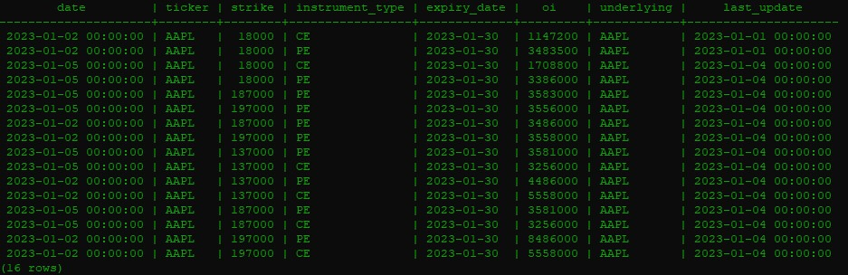
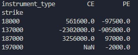

# Open Interest (OI) Difference Calculator

A python script which calculates the Open Interest (OI) difference between two dates with same **instrument_type** and **same strike** using pandas library.

## Packages/Libraries used:

* pandas==1.5.3
* psycopg2==2.9.5
* python-dotenv==1.0.0

## Environment variables:

All the environment variables used for this project is listed in the ***env.sample*** file.

Create a ***.env*** file in the root of the repository (same location as the python script file is located). Copy and paste all the environment variables listed in the ***env.sample*** file and value to that variables.

The python script will load environment variables from the ***.env*** file and use it.

## Sample Data:

## OUTPUT:

for start_date = '2023-01-02' and end_date = '2023-01-05'

